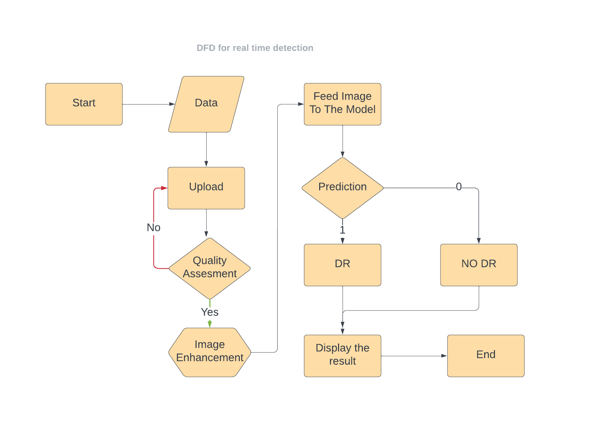

## Diabetic Retinopathy Detection App

This is a Diabetic Retinopathy Detection app built using Next.js. The app uses a machine learning model to classify fundus images and detect the presence of diabetic retinopathy.

### Project Setup

To set up the project, follow these steps:

1. Create the model:
   - First, you need to gather the necessary data for training the model. Obtain fundus images along with their quality grading and diabetic retinopathy grading in CSV format.
   - Use the CSV file and the image data to filter out the trainable images by running the `main.py` script.

2. Preprocess the images:
   - The preprocessing step is crucial for improving the quality and contrast of the fundus images before training the model.
   - In the `preprocess.py` script, various preprocessing techniques are applied to the images, such as converting them to grayscale, cropping, resizing, and equalizing the histogram.
   - You can customize the preprocessing techniques in the `preprocess.py` script according to your requirements.

3. Augment the data (optional):
   - If you don't have enough data for training, you can run the `process.py` script to augment the existing data. This will help increase the diversity of the training set.

4. Train the model:
   - Once the data is prepared and preprocessed, you can train the model by running the `dr_detection.ipynb` notebook.
   - The notebook uses deep learning algorithms to train the model on the fundus images.

5. Save the model:
   - After training, save the trained model.
   - Copy the saved model to the `/public/ts-js/` folder in your Next.js project. This folder structure is assumed in the `index.js` file of the app.
6. Install Required Packages for Next.js App:
    -To run the Next.js app, make sure you have Node.js installed. The required Node.js version is 18.17.0.

    
    
    
### Example Preprocessing Techniques

The `preprocess.py` script includes various preprocessing techniques. Here is a summary of the techniques used:

1. Convert the image to grayscale and produce a mask.
2. Find the bounding rectangle of the mask and crop the image.
3. Resize the cropped image and create a circular mask.
4. Combine the resized image with the circular mask and remove the black border.
5. Convert the image to the HSV format.
6. Split the HSV image into Hue, Saturation, and Value channels.
7. Equalize the histogram of the Hue and Value channels using CLAHE.
8. Merge the equalized Hue, original Saturation, and equalized Value channels.
9. Convert the equalized HSV image back to the RGB format.

Feel free to modify or add other preprocessing techniques in the `preprocess.py` script according to your specific requirements.

